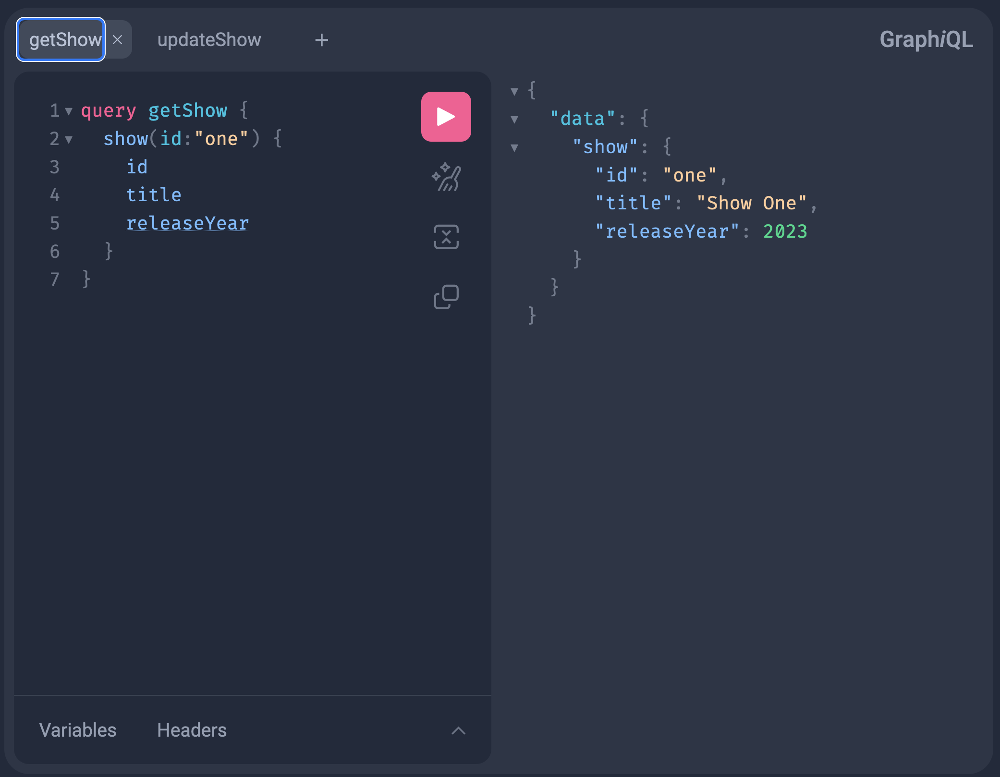
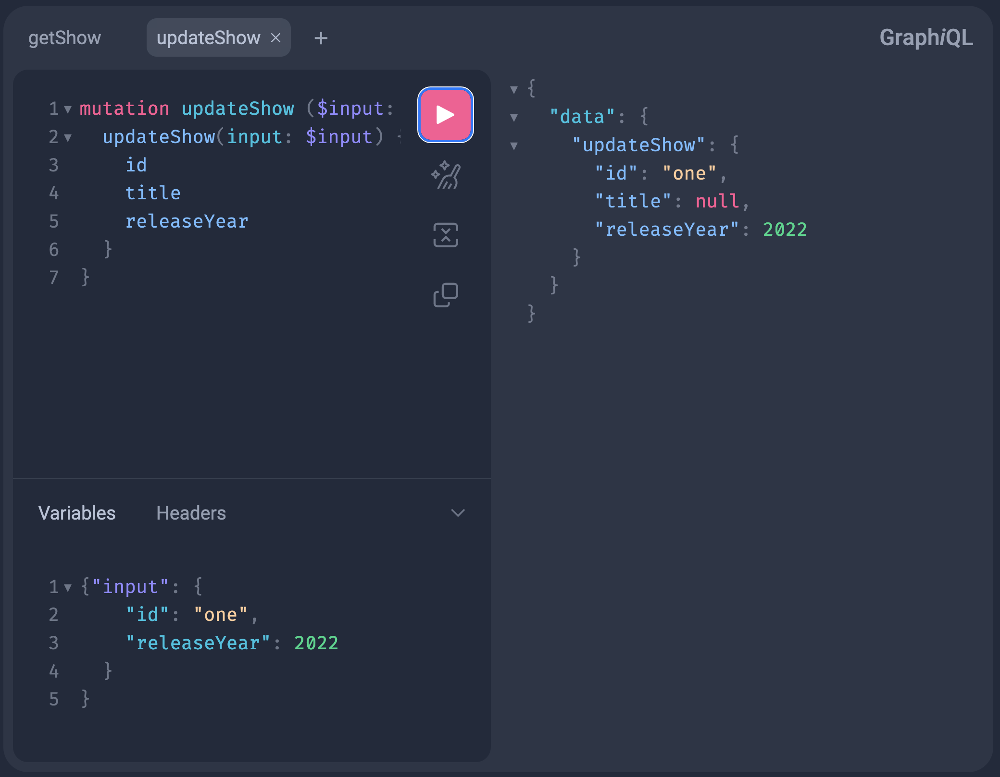
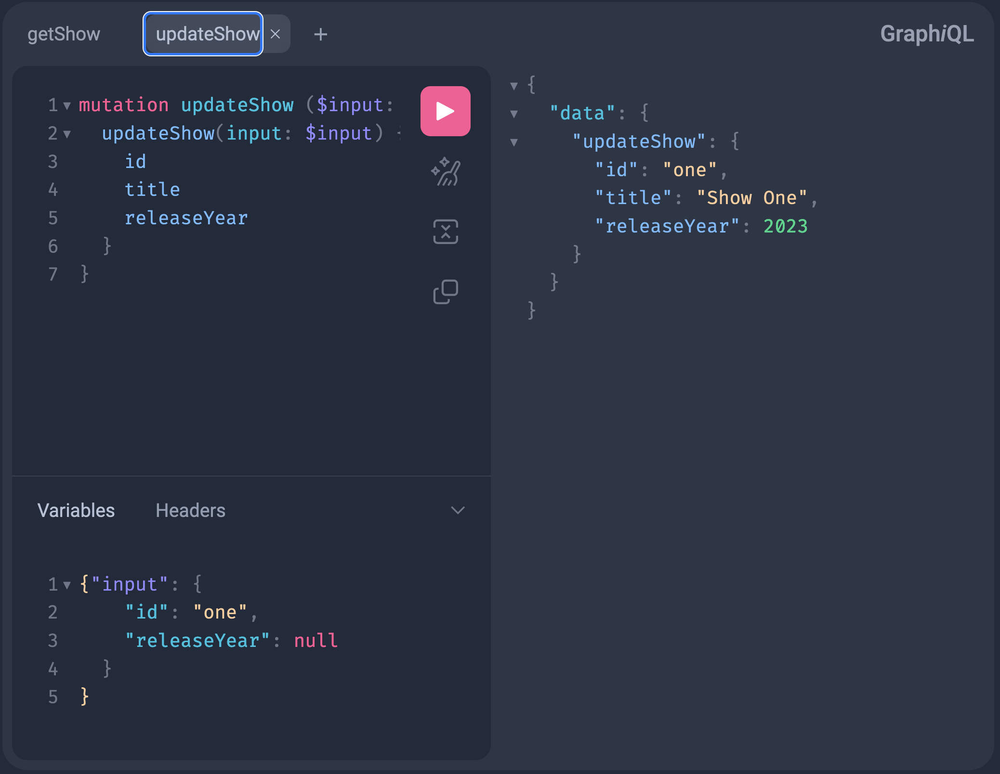
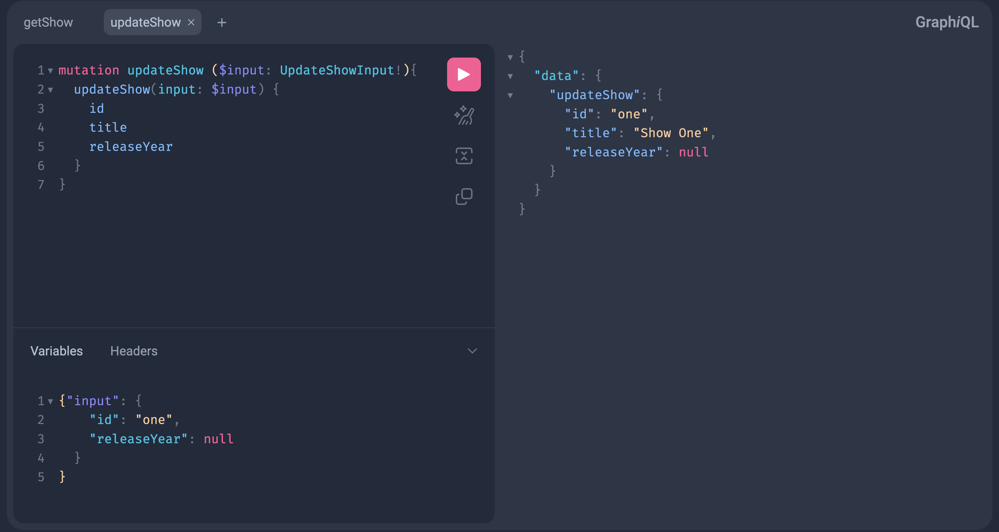

# GraphQL API Sparse Update
This project is a demonstration of this issue: [dgs-codegen-issue-609](https://github.com/Netflix/dgs-codegen/issues/609)


## How to run the app
* Clone [this](https://github.com/ramapalani/sparseupdate) git repository 
* Start the DGS/Spring boot app using this command
```
cd app
./mvnw clean spring-boot:run
```

## Demonstrate Sparse Update Issue

```shell
# Install Java 17 or above
# Checkout the reproducing issue tag
git checkout issue-609
cd app
mvn -N wrapper:wrapper -Dmaven=3.9.5
# Build and run the DGS springboot app
./mvnw clean spring-boot:run
```

### Get details of a Show with ID "One"
* Open GraphiQL at http://localhost:8080/graphiql
* Copy this query and execute it
```graphql
query getShow {
  show(id: "one") {
    title
    releaseYear
  }
}
```

* Equivalent curl command
```shell
curl 'http://localhost:8080/graphql' -X POST \
  -H 'Accept: application/json' \
  -H 'Content-Type: application/json' \
  --data-raw '{"query":"query getShow {\n  show(id: \"one\") {\n    title\n    releaseYear\n  }\n}","variables":{"input":{"id":"one","releaseYear":2023}},"operationName":"getShow"}'
{"data":{"show":{"title":"Show One","releaseYear":2023}}}
```

### Update "One" Show's release year to 2022
Call mutation `updateShow` and try to update Show with ID "One"'s `releaseYear` to 2022.  This will set the field `title` to null. 

* Open GraphiQL at http://localhost:8080/graphiql
* Copy this mutation
```graphql
mutation updateShow($input: UpdateShowInput!) {
  updateShow(input: $input) {
    id
    title
    releaseYear
  }
}
```
* Copy this input and execute it
```json
{
  "input": {
    "id": "one",
    "releaseYear": null
  }
}
```

* Equivalent curl command
```shell
curl 'http://localhost:8080/graphql' -X POST \
  -H 'Accept: application/json' \
  -H 'Content-Type: application/json' \
  --data-raw '{"query":"mutation updateShow($input: UpdateShowInput!) {\n  updateShow(input: $input) {\n    id\n    title\n    releaseYear\n  }\n}","variables":{"input":{"id":"one","releaseYear":2022}},"operationName":"updateShow"}'
{"data":{"updateShow":{"id":"one","title":null,"releaseYear":2022}}}
```

### Retain existing values, when not present in input
To fix the null problem, update mapper to retain field values if the input is null.
The null field issue could be fixed by [updating the mapper](https://github.com/ramapalani/sparseupdate/blob/3d780f153cff00168076bdca610eec8dcfe04485/app/src/main/java/com/intuit/sparseupdate/ShowDataFetcher.java#L61-L76) to retain existing values, when an input field is not given

But if the requirement is to set a field explicitly to `null`, this mapper will not be able to do it.


## Sparse Update Fix

### Demo
```shell
git checkout issue-609-reflected-model-setBitset
cd app
# If .mvn folder is not present, run this command
# mvn -N wrapper:wrapper -Dmaven=3.9.5
# Build and run the DGS springboot app
./mvnw clean spring-boot:run
```

* Curl equivalent 
```shell
curl 'http://localhost:8080/graphql' -X POST \
  -H 'Accept: application/json' \
  -H 'Content-Type: application/json' \
  --data-raw '{"query":"mutation updateShow($input: UpdateShowInput!) {\n  updateShow(input: $input) {\n    id\n    title\n    releaseYear\n  }\n}","variables":{"input":{"id":"one","releaseYear":null}},"operationName":"updateShow"}'
{"data":{"updateShow":{"id":"one","title":"Show One","releaseYear":null}}}
```

### Changes to Model classes
All generated model classes corresponding to an input type should have a flag, whether a field is set or not.  This could be implemented as a boolean, but it is not efficient, so a BitSet is added to every input model class.  This BitSet variable is set as transient, so this doesn't change the serialization of the model class.

Whenever an input type's field is set, [setField()](https://github.com/ramapalani/sparseupdate/blob/ae902fb9b92ebc07e14d6ec41ca3d766afe7da4b/app/src/main/java/com/intuit/sparseupdate/generated/types/UpdateShowInput.java#L12-L14) method will be called to turn on the appropriate bit in the bitset.

For easier operation create an [Enum](https://github.com/ramapalani/sparseupdate/blob/ae902fb9b92ebc07e14d6ec41ca3d766afe7da4b/app/src/main/java/com/intuit/sparseupdate/generated/types/UpdateShowInput.java#L124-L138) with all fields and set a unique ordinal for each field in the input model class.

Also update the [Builder.build()](https://github.com/ramapalani/sparseupdate/blob/ae902fb9b92ebc07e14d6ec41ca3d766afe7da4b/app/src/main/java/com/intuit/sparseupdate/generated/types/UpdateShowInput.java#L91-L102) to mark fields that were set

### Changes to Mapper Method
In the [mapper method](https://github.com/ramapalani/sparseupdate/blob/ae902fb9b92ebc07e14d6ec41ca3d766afe7da4b/app/src/main/java/com/intuit/sparseupdate/ShowDataFetcher.java#L125-L128), if a field is set, use that value, if not use the existing value

### Automatically convert input json to input Model objects aware of fields set 
DGS automatically maps input json to input model objects using Reflection primarily by using one of these methods [DefaultInputObjectMapper.mapToJavaObject()](https://github.com/Netflix/dgs-framework/blob/master/graphql-dgs/src/main/kotlin/com/netflix/graphql/dgs/internal/DefaultInputObjectMapper.kt#L107) or [DefaultInputObjectMapper.mapToKotlinObject()](https://github.com/Netflix/dgs-framework/blob/master/graphql-dgs/src/main/kotlin/com/netflix/graphql/dgs/internal/DefaultInputObjectMapper.kt#L72)

Update these methods to be aware of whether a field was set or not.  The mapToJavaObject() could be modified similar to this method [ShowDataFetcher.getInputArgument()](https://github.com/ramapalani/sparseupdate/blob/ae902fb9b92ebc07e14d6ec41ca3d766afe7da4b/app/src/main/java/com/intuit/sparseupdate/ShowDataFetcher.java#L62-L113)

This could be optimized further by having some sort of caching(not doing the same task again and again) and exiting out faster when there is no BitSet field (setField awareness is not required).
